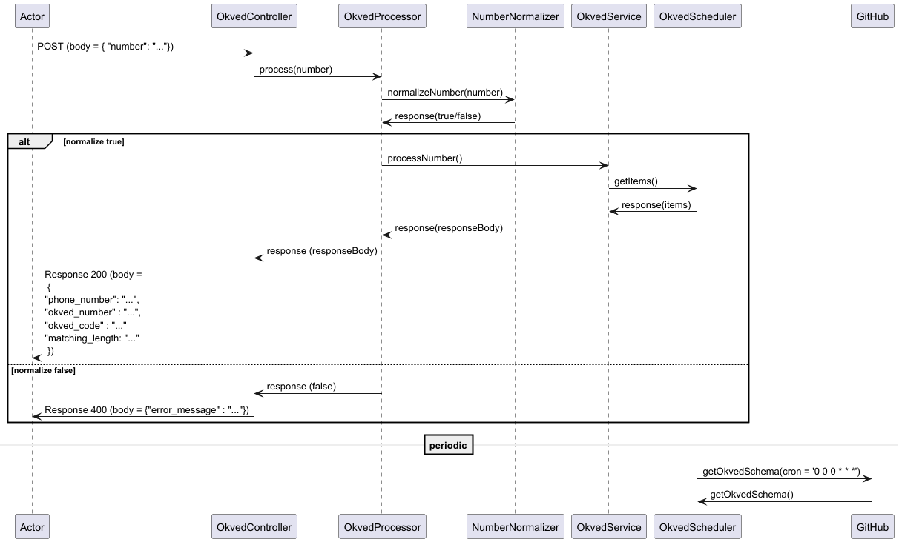

# Игра «Найди свой ОКВЭД по номеру телефона» (Тестовое задание на должность Ведущего Java-разработчика в Правительство Москвы )

## Задача

* Принять строку содержащую **российский мобильный номер** в любом формате (ввод без ограничений). Спроектировать общий алгоритм нормализации. Результат — строго `+79XXXXXXXXX`. Если нормализовать нельзя — вернуть `false` + ошибку.

* По HTTPS загрузить `okved.json` из этого репозитория (файл обновляется ежедневно).

* Найти код ОКВЭД с максимальным совпадением по **окончанию** нормализованного номера. Если совпадений нет — применить **резервную стратегию** (на выбор разработчика).

* Вывести нормализованный номер, найденный ОКВЭД (код и название), длину совпадения.

* Это игра — в приоритете полные совпадения. Каждый шаг оформить как отдельную функцию/класс (в зависимости от языка программирования).

* Код следует единому стандарту документации/комментариев. Укажите, какому стандарту придерживается ваше решение (на выбор разработчика).

* Разрешается использовать библиотеки, фреймворки и boilerplates с открытой лицензией **MIT (или эквивалентной)** при условии предоставления ссылки на источник в README.

* В приоритете качество кода, а не его количество. Приложить краткую инструкцию по запуску.


## Краткое описание решения

* Предложенное решение написано на языке Java с использованием SpringBoot. Sequence-диаграмма классов и компонент:

* Алгоритм нормализации номера телефона имплементирован в классе NumberNormalizer
* Логика загрузки okved.json из репозитория представлена в классе OkvedScheduler (рекурсивный обход json-файла). CRON-job запускает метод getOkvedData (для удобства тестирования текущее cron-выражение соответствует загрузке раз в минуту. С учётом того условия, что схема обновляется раз в день, можно заменить cron-выражение на "0 0 0 * * *" в файле custom.properties).
* Алгоритм поиска наилучшего совпадения имплементирован в классе OkvedService. По умолчанию итерируемся по всем узлам, ищем такие узлы, на ОКВЭД-номера которых оканчивается номер телефона. Если таких узлов несколько, выбираем тот, у которого длина номера наибольшая. 
* Резервная стратегия: если совпадений нет, то вначале ищем совпадение по двум последним цифрам ОКВЭД-номера. Если и таких совпадений нет, то выдаём первый же ОКВЭД-номер, последняя цифра которого совпадает с последней цифрой номера телефона.
* Запустить приложение на localhost можно напрямую из среды разработки IntelliJIdea. По умолчанию приложение запускается на порту 8080.
* Доступен единственный эндпойнт для POST-запроса. Пример запроса:

```
POST 
http://localhost:8080/api/v1/okved
```

Пример тела запроса:

```
{
  "phone_number" : "+79269999909"
}
```
Пример корректного ответа (статус 200) 

```
{
  "phone_number": "+79269999909",
  "okved_code": "09",
  "okved_name": "Предоставление услуг в области добычи полезных ископаемых",
  "matching_length": 2
}
```

Пример ответа на запрос, содержащий некорректный номер телефона (статус 400)
```
{
  "error_message": "The number doesn't match to Russian mobile number standards"
}
```
* Классы OkvedService и NumberNormalizer покрыты юнит-тестами